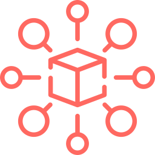

# use-codex

[](https://www.npmjs.com/package/use-codex)
[](https://www.npmjs.com/package/use-codex)

[](https://use-codex.netlify.app)

A library for migration from `Redux Toolkit` to `Context API`

## Installation

```sh
# NPM
npm install --save use-codex

# YARN
yarn add use-codex
```

For more details, see the [Installation docs page.](https://use-codex.netlify.app/#installation)

## Documentation

The Codex docs are located at [**https://use-codex.netlify.app**](https://use-codex.netlify.app)


## Table of Contents

### Getting Started

* [Introduction](https://use-codex.netlify.app/introduction)
* [Core Concepts](https://use-codex.netlify.app/introduction/core-concepts)

### API

* [Provider](https://use-codex.netlify.app/api/Provider)
* [configureStore](https://use-codex.netlify.app/api/configureStore)
* [connect](https://use-codex.netlify.app/api/connect)
* [createSlice](https://use-codex.netlify.app/api/createSlice)
* [useConsumer](https://use-codex.netlify.app/api/useConsumer)
* [useDispatch](https://use-codex.netlify.app/api/useConsumer)
* [useSelector](https://use-codex.netlify.app/api/useSelector)